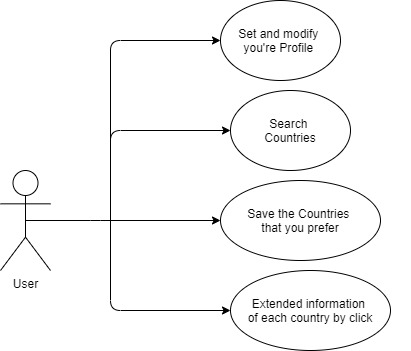
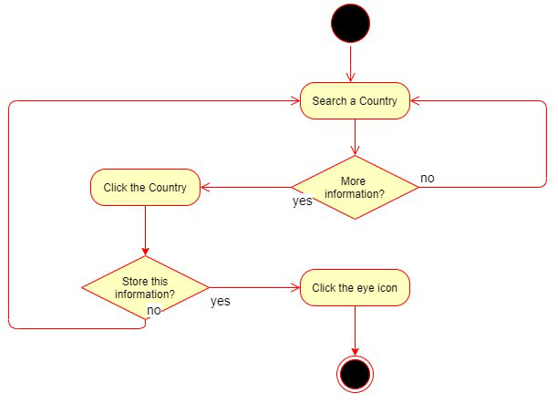
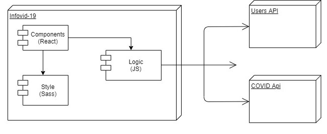
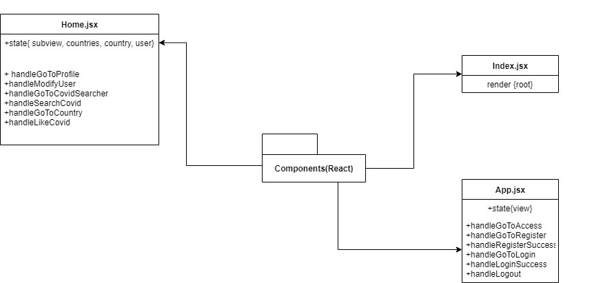
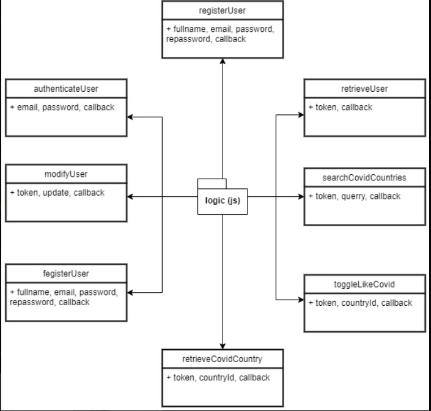
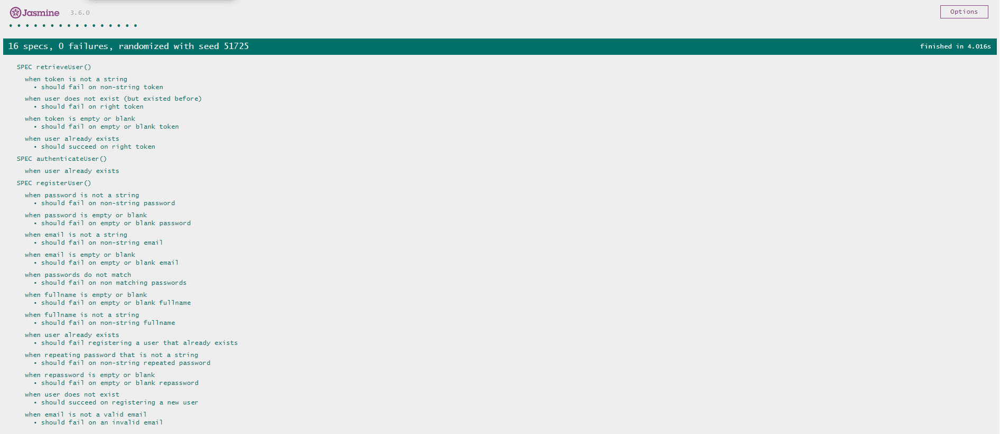

# Infovid-19 App

## Introduction

Virtual App that search Covid-19 data from diferent countries (covid cases, covid deaths, people recovered, etc.)

## Functional Description

### Use Cases

### Activities

Search country information 

## Technical Description

### Blocks

### Packages

#### React components

#### Logic functions

### Testing (QA)

### Technologies

### TODO

- likes list
- unregister user
- fix styles
- desktop version
- show data in a bar graphic